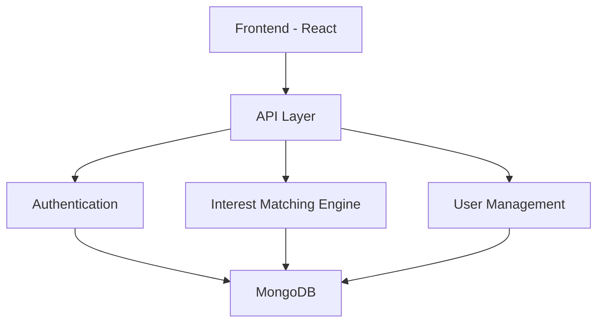

<div align="center">  
  
## 👨‍💻👩‍💻Interest Fusion
  
  [](https://choosealicense.com/licenses/mit/)
  [](https://github.com/KGupta2601/HackThisFall_InterestFusion/issues)
  [](https://github.com/KGupta2601/HackThisFall_InterestFusion/pulls)
  [](https://github.com/KGupta2601/HackThisFall_InterestFusion/commits/main)

  🤝 Connecting minds, fostering relationships, and building communities through shared interests
</div>

---

## 🌟 Overview

Interest Fusion is an innovative platform tackling mental health challenges in educational institutions by creating meaningful connections through shared interests. We're revolutionizing how students connect, making social interactions more natural and anxiety-free.

<details>
<summary>💡 Why Interest Fusion?</summary>

- 🎯 **Targeted Connections**: Match with peers sharing your genuine interests
- 🔒 **Privacy First**: Your data is shared only with mutual consent
- 🎮 **User-Friendly**: Simple, intuitive interface without overwhelming questionnaires
- 🛡️ **Secure**: Robust verification and safety measures
- 🤖 **Smart Matching**: Advanced algorithms using tree data structures
</details>

## 🚀 Features

### Current Capabilities
- ✨ **Smart Profile Creation**
  - Customizable interest tags
  - Authenticated profiles using favorite technique
  - Minimal yet meaningful data collection
  
- 🤝 **Intelligent Matching**
  - Interest-based connection suggestions
  - Privacy-preserved profile viewing
  - Mutual consent-based information sharing

- 🔐 **Security Measures**
  - OTP verification (Vonage API integration)
  - SSN-based user authentication
  - Encrypted data storage

### 🔮 Future Roadmap
- 📈 **Scalability**
  - Enhanced database architecture
  - Load balancing implementation
  - Performance optimization

- 🛡️ **Enhanced Safety**
  - AI-powered content moderation
  - Advanced user verification
  - Real-time suspicious activity detection

- 💬 **Communication**
  - Secure in-app messaging
  - Interest-based group chats
  - Content filtering system

## 🛠️ Quick Start

### Prerequisites
```bash
Node.js >= v14
MongoDB
npm or yarn
```

### Installation

1. **Clone the repository**
```bash
git clone https://github.com/KGupta2601/HackThisFall_InterestFusion.git
cd HackThisFall_InterestFusion
```

2. **Environment Setup**
```bash
cp .env.example .env
# Edit .env with your configurations
```

3. **Install Dependencies**
```bash
npm install
```

4. **Start Development Server**
```bash
npm run dev
```

<details>
<summary>📝 Configuration Options</summary>

| Variable | Description | Default |
|----------|-------------|---------|
| `PORT` | Server port | 3000 |
| `MONGODB_URI` | MongoDB connection string | mongodb://localhost:27017 |
| `JWT_SECRET` | JWT encryption key | - |
| `VONAGE_API_KEY` | Vonage API key for OTP | - |

</details>

## 🏗️ Architecture



## 🤝 Contributing

We welcome contributions! Check out our [Contributing Guidelines](CONTRIBUTING.md) for details on how to get started.

<details>
<summary>👥 Contributors</summary>

<a href="https://github.com/KGupta2601/HackThisFall_InterestFusion/graphs/contributors">
  
</a>

</details>

## 📄 License

This project is licensed under the MIT License - see the [LICENSE](LICENSE) file for details.

## 📞 Support

- 📧 Email: gkashika26@gmail.com
- 💬 [Discord Community](https://discord.gg/interestfusion)
- 📚 [Documentation](https://docs.interestfusion.com)

---

<div align="center">
  Made with ❤️ by the Interest Fusion Team
</div>

**CONTRIBUTING.md:**

# 🤝 Contributing to Interest Fusion

First off, thank you for considering contributing to Interest Fusion! It's people like you that make Interest Fusion such a great tool. 🌟

## 📋 Table of Contents

- [Code of Conduct](#code-of-conduct)
- [Getting Started](#getting-started)
- [Development Workflow](#development-workflow)
- [Pull Request Process](#pull-request-process)
- [Style Guidelines](#style-guidelines)
- [Community](#community)

## 📜 Code of Conduct

We take our open source community seriously and hold ourselves and other contributors to high standards of communication. By participating and contributing to this project, you agree to uphold our [Code of Conduct](CODE_OF_CONDUCT.md).

## 🚀 Getting Started

### 1. Fork the Repository
Click the 'Fork' button at the top right of this page.

### 2. Clone Your Fork
```bash
git clone https://github.com/your-username/HackThisFall_InterestFusion.git
cd HackThisFall_InterestFusion
```

### 3. Set Up Development Environment
```bash
# Add upstream remote
git remote add upstream https://github.com/KGupta2601/HackThisFall_InterestFusion.git

# Install dependencies
npm install

# Create branch for your feature
git checkout -b feature/your-feature-name
```

## 💻 Development Workflow

1. **Pick an Issue**
   - Look for issues labeled `good first issue` or `help wanted`
   - Comment on the issue to let others know you're working on it

2. **Create a Branch**
   ```bash
   git checkout -b feature/issue-number-short-description
   ```

3. **Make Changes**
   - Write clear, commented code
   - Follow our style guidelines
   - Add tests for new features

4. **Commit Changes**
   ```bash
   git add .
   git commit -m "type: brief description

   - Detailed description
   - Another point

   Closes #123"
   ```

   Commit types:
   - `feat:` New feature
   - `fix:` Bug fix
   - `docs:` Documentation
   - `style:` Formatting
   - `refactor:` Code restructuring
   - `test:` Adding tests
   - `chore:` Maintenance

## 🔄 Pull Request Process

1. **Update Your Fork**
   ```bash
   git fetch upstream
   git rebase upstream/main
   ```

2. **Push Changes**
   ```bash
   git push origin feature/your-feature-name
   ```

3. **Create Pull Request**
   - Use our PR template
   - Link related issues
   - Add screenshots if relevant

4. **Code Review**
   - Address review comments
   - Keep discussions focused
   - Be patient and respectful

## 🎨 Style Guidelines

### Code Style

```javascript
// Good
function calculateInterestMatch(userInterests, otherInterests) {
  return userInterests.filter(interest => 
    otherInterests.includes(interest)
  ).length;
}

// Bad
function calc(i1, i2) {
  return i1.filter(i => i2.includes(i)).length;
}
```

### Documentation Style

```javascript
/**
 * Calculates interest match percentage between two users
 * @param {string[]} userInterests - First user's interests
 * @param {string[]} otherInterests - Second user's interests
 * @returns {number} Match percentage from 0 to 100
 */
```

## 👥 Community

- Join our [Discord](https://discord.gg/sYKpXXxmVp)
- Follow us on [Twitter](https://x.com/InterestFusion)
- Read our [Blog](https://blog.interestfusion.com)


## 🎉 Recognition

Contributors get:
- Recognition in our README
- Contributor badge on our platform
- Priority access to beta features
- Invitation to contributor-only events

---
  
